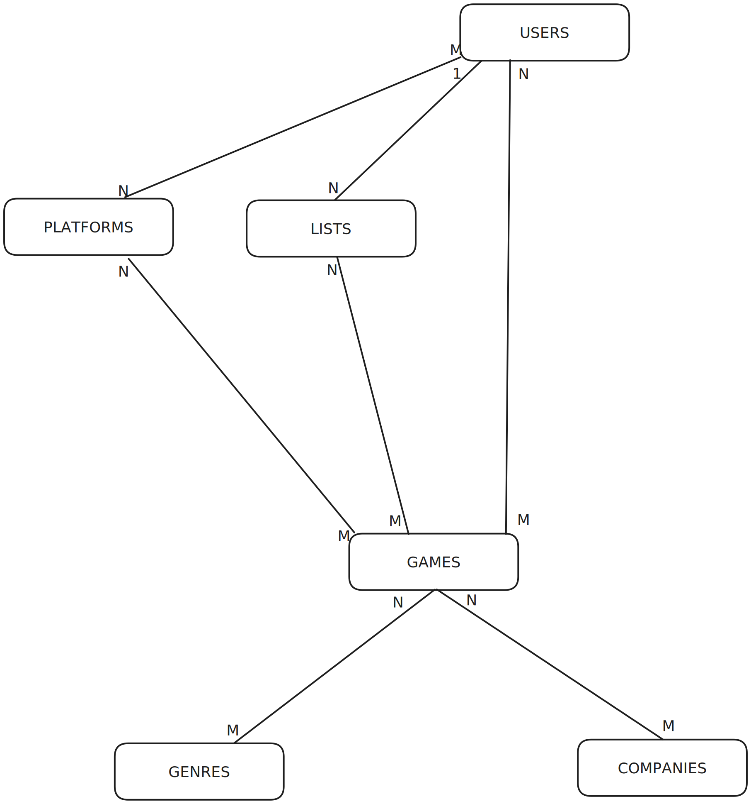

# GameArchive - Rodrigo Iglesias
## Modelo de base de datos: Entidad relación

### Tablas:
- USERS
- PLATFORMS
- LISTS
- GAMES
- GENRES
- COMPANIES

### Tablas por relaciones N:M:
- USERS_PLATFORMS
- RATINGS (USERS - GAMES)
- PLATFORMS_GAMES
- LISTS_GAMES
- GAMES_GENRES
- GAMES_COMPANIES

### Todas las tablas:
- USERS
- PLATFORMS
- LISTS
- GAMES
- GENRES
- COMPANIES
- USERS_PLATFORMS
- RATINGS (USERS - GAMES)
- PLATFORMS_GAMES
- LISTS_GAMES
- GAMES_GENRES
- GAMES_COMPANIES

### Funcionalidades por tablas
> Posibles cambios en las columnas de las tablas
#### Tabla: USERS
Almacenará la información sobre todos los usuarios de la aplicación
##### Columnas
- username (String)(PK) `Nombre único de usuario`
- email (String) `Email del usuario`
- passwordHash (String) `Contraseña encriptada con BCrypt`
- lists (Array)(FK) `Array de listas que pertenecen al usuario`
- profile_picture (String) `Link a imagen anónima de imgur.com utilizando la API`
- created_at (Timestamp) `Momento en el que se creó la cuenta`

#### Tabla: GENRES
Almacenará la información sobre los géneros de los videojuegos
##### Columnas
- checksum (String)(PK) `UUID obtenido de IGDB API`
- name (String) `Nombre del género`

#### Tabla: PLATFORMS
Almacenará la información sobre las plataforas
##### Columnas
- checksum (String) `UUID obtenido de IGDB API`
- abbreviation (String) `Abreviación del nombre de la plataforma`
- logo (String) `Link a imagen del logo usando link de imagen de IGDB`
- name (String) `Nombre de la plataforma`

#### Tabla: GAMES
Almacenará la información sobre los videojuegos
##### Columnas
- checksum (String)(PK) `UUID del juego obtenido de IGDB API`
- cover (String) `ID de la imagen cover`
- name (String) `Nombre del videojuego`
- igdb_rating (float) `Nota del videojuego en IGDB.com`
- rating_count (int) `Número de valoraciones en IGDB.com`
- summary (Text) `Descripción sobre el videojuego`
- artwork (String) `ID de la imagen de artwork/banner del juego`
> Ejemplo de cover

Ejemplo de artwork

#### Tabla: COMPANIES
Almacenará la información sobre las companías de videojuegos
##### Columnas
- checksum (String) `UUID de la companía obtenida de IGDB API`
- logo (String) `ID del logo`
- name (String) `Nombre de la companía`
- start_date (Date) `Fecha en la que se fundó`

## ¿Cuando se utilizará la API de IGDB o la Base de datos?
Al realizar las búsquedas de videojuegos se cargarán los datos de la API en la aplicación, en el momento en el que un usuario guarde un juego en una lista se guardarán los datos de ese juego en la base de datos.

Previamente en la BD ya estarán las plataformas ya que el usuario podrá marcar de que plataformas dispone para únicamente recomendarle juegos a los que pueda jugar. Las recomendaciones se basarán en los juegos que tiene añadidos a listas, búscando así en la BD juegos relacionados utilizando la API o juegos del mismo género o similares utilizando la API.

### Referencias a WEBs
[IGDB](https://www.igdb.com/)
[IGDB API](https://api-docs.igdb.com/)

[Imgur](https://www.igdb.com/)
[Imgur API](https://apidocs.imgur.com/)